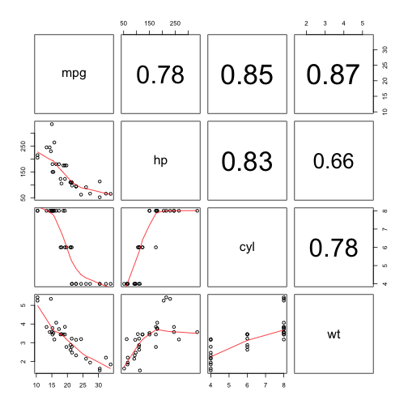

Developing Data Products Project
========================================================
author: Sumithra Sundaram
date: June 27, 2016
type: section
transition: rotate

Introduction
========================================================
transition: linear
This presentation is part of the project in the Developing Data Products course.  The project is of two parts.
 
  1. Shiny application
  2. Reproducible pitch presentation.

The application developed as the first part of the assignment is avalilable at:
https://sumithras.shinyapps.io/Shiny/

Source code for ui.R and server.R files are available on the GitHub:
https://github.com/sumithras/Developing-Data-Products

Car mileage modelling
========================================================
transition: linear

The application uses the data in the mtcars dataset to model car mileage using linear regression. 

It allows a flexible way to select model features and anlyse the goodness of fit. Features can be selected or unselected by clicking the corresponding checkbox. The model summary along with feature pairs plot and correlation is displayed immediately.

mtcars dataset
========================================================
transition: linear
The data was extracted from the 1974 Motor Trend US magazine, and comprises fuel consumption and 10 aspects of automobile design and performance for 32 automobiles (1973–74 models). It is a data frame with 32 observations on 11 variables.
  
Source -
Henderson and Velleman (1981), Building multiple regression models interactively. Biometrics, 37, 391–411.

Sample Pairs Plot with Correlation
========================================================

